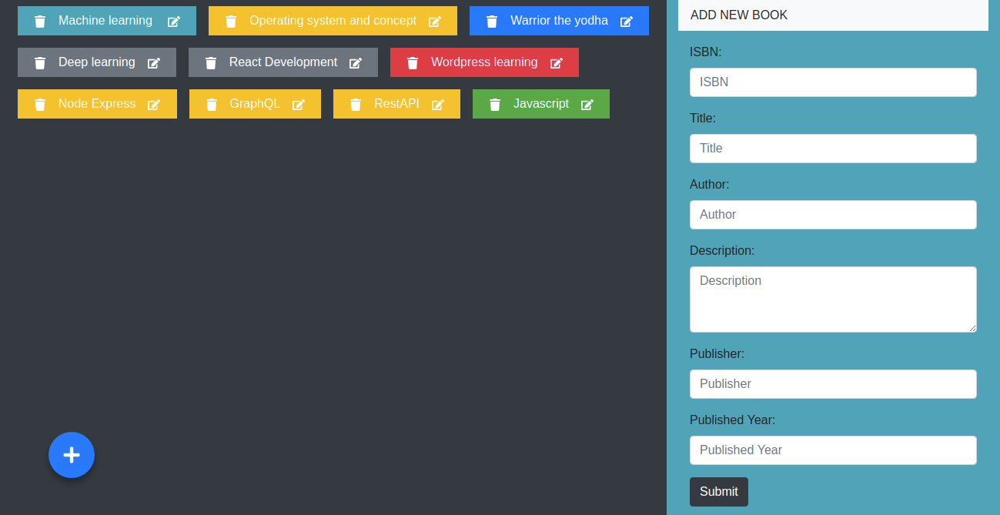
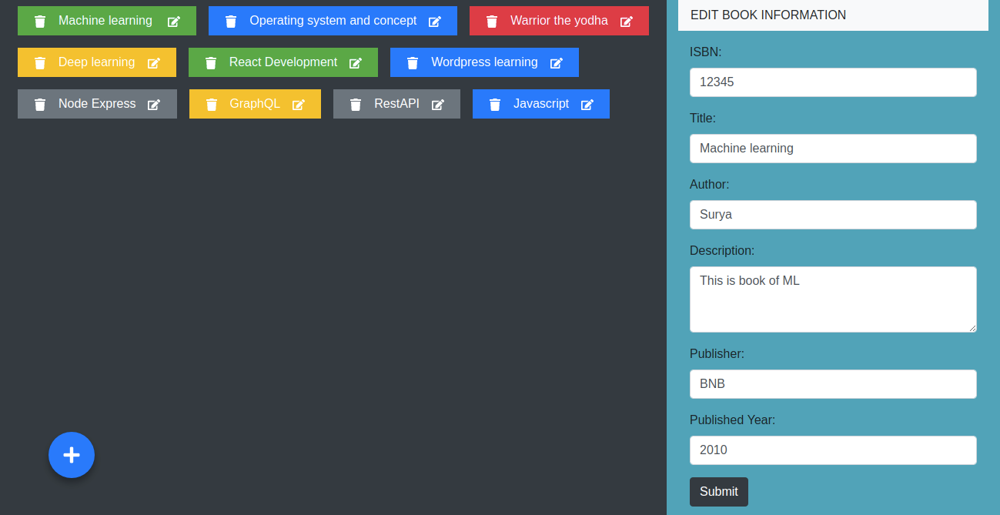
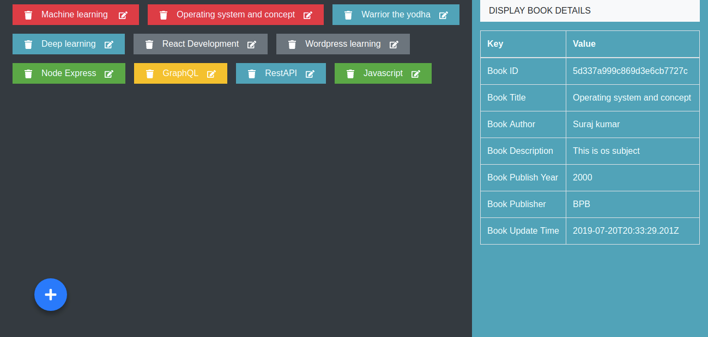

## This is Book store demo app for crud operation using Nodejs with Express, React, MongoDB and GraphQL.

**To start the execution follow this step:-**

>### **client**
	npm start

Before start the exection make sure you have already install node.

	npm install

>### **server**
	node ./bin/www

Before start server make sure libs should install for gql server :-

	npm install

#### Demo Screen short

Thank you :sweat_smile:
